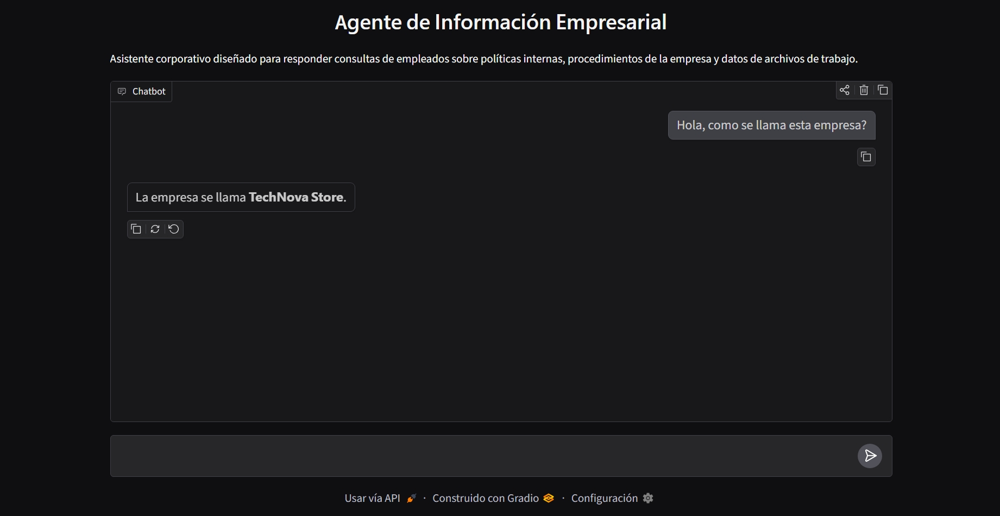
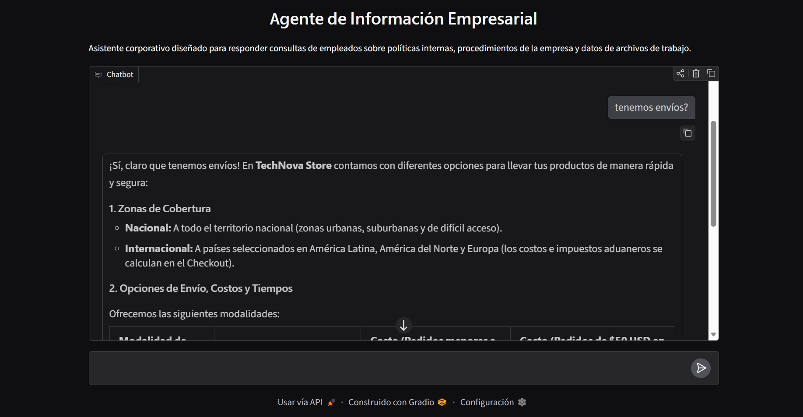
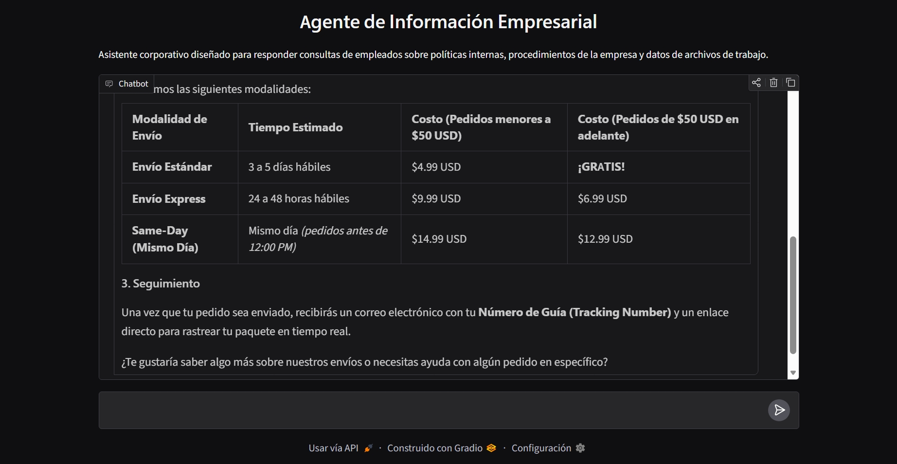

# 🤖 Challenge Agente Alura

Un agente de inteligencia artificial avanzado diseñado para responder consultas corporativas combinando **recuperación RAG para documentos de texto** (PDF, DOCX, MD, TXT) y **ejecución dinámica de consultas para datos estructurados** (CSV, XLSX, XLS).

<p align="center">
  
  
  
</p>

---

## 🏗️ Descripción de la Arquitectura

El sistema utiliza una arquitectura modular basada en grafos de decisión que analiza la intención de la consulta y delega el procesamiento al motor adecuado:

```
                                 [ 💬 Consulta del Usuario ]
                                             │
                                             ▼
                               [ 🧠 Agente de Información ]
                                      │              │
                   ┌──────────────────┘              └──────────────────┐
                   ▼                                                    ▼
   [ 📄 Herramienta de Documentos ]                    [ 📊 Herramienta de Datos Tabulares ]
   - Archivos: .pdf, .docx, .md, .txt                   - Archivos: .csv, .xlsx, .xls
   - Embeddings: Modelo multilingüe local               - Inspección dinámica de columnas
   - Base Vectorial: FAISS                              - Consultas y análisis con Pandas
                   │                                                    │
                   └──────────────────┐              ┌──────────────────┘
                                      ▼              ▼
                                [ 💬 Respuesta en Streaming ]
                                (Interfaz de Chat - Puerto 7860)
```

### 🛠️ Componentes Clave:

1. **🧠 Orquestador Inteligente:** Procesa y comprende la consulta del usuario para decidir si requiere consultar documentación normativa o realizar cálculos sobre tablas.
2. **📊 Módulo de Análisis Tabular:** Permite al agente consultar, filtrar, agrupar o calcular estadísticas sobre cualquier archivo CSV o libro de Excel (`.xlsx`, `.xls`) presente en la base de conocimientos, adaptándose automáticamente a la estructura de las columnas.
3. **📄 Buscador Semántico FAISS:** Fragmenta e indiza localmente la información de documentos de texto no estructurados para responder preguntas sobre normativas y políticas corporativas.
4. **💬 Interfaz de Chat con Streaming:** Servidor web interactivo con transmisión de respuestas en tiempo real servido en `http://127.0.0.1:7860`.

---

## 📋 Requisitos Previos

* 🐍 **Python >= 3.10**
* ⚡ **`uv` instalado**
* 🔑 **Clave API de Google Gemini (`GEMINI_API_KEY`)**

---

## ⚙️ Instalación y Configuración

1. **Instalar dependencias con `uv`:**
   ```bash
   uv sync
   ```

2. **Configurar las variables de entorno:**
   Crea un archivo `.env` en la raíz del proyecto basándote en la plantilla `.env.example`:
   ```bash
   GEMINI_API_KEY=tu_clave_api_de_gemini_aqui
   ```

3. **Documentos de la empresa:**
   Coloca tus documentos (`.md`, `.pdf`, `.docx`, `.doc`, `.txt`, `.csv`, `.xlsx`, `.xls`) en la carpeta `datos/`.

---

## 🚀 Ejecución

Lanza el agente ejecutando:

```bash
uv run python app.py
```

La interfaz web estará disponible en `http://127.0.0.1:7860`.

---

## ❓ Preguntas Frecuentes (FAQ)

### 📊 ¿Cómo maneja el agente los archivos CSV y Excel?
El agente identifica los archivos tabulares en la carpeta de datos, examina sus encabezados y ejecuta consultas dinámicas para entregar filtrados y búsquedas exactas.

### 📄 ¿Qué ocurre con los archivos de texto (PDF, DOCX, MD)?
Se fragmentan e indizan localmente en memoria utilizando vectores semánticos, permitiendo responder con precisión sobre políticas y procedimientos corporativos.
